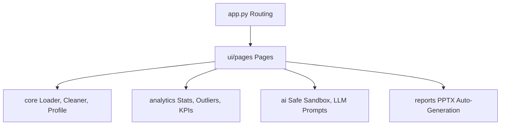

# 📊 Excel Auto-Analyst v2.0

> An enterprise-grade, AI-powered data analytics and automated reporting platform. Clean, profile, analyze, and generate professional PowerPoint reports with one click.

[](https://python.org)
[](https://streamlit.io)
[](https://pypi.org/project/RestrictedPython/)
[](https://opensource.org/licenses/MIT)
[](https://github.com/Shweta-Mishra-ai/excel-auto-analyst)

---

## 🌟 Key Features

*   **Smart Cleaning & Imputation**: Handles missing numerical values via robust statistics (mean, median, forward fill) rather than silently corrupting data with zeros. Categorical mode imputation and duplicate row pruning.
*   **Instant Automated Dashboards**: Interactive KPIs, histograms, and categorical distribution breakdowns using dynamic Plotly charts.
*   **Correlation & Outliers**: Built-in Pearson/Spearman correlation heatmaps and automated outlier detection (using Z-Score or IQR methods).
*   **Secured AI Chat**: Ask plain-English questions of your datasets. The integrated LLM translates questions to python commands executed inside a secure, sandboxed environment.
*   **One-Click PPT Reports**: Instantly generates complete PowerPoint presentations containing your data overview, KPI metrics, statistical tables, outlier reports, and AI insights.

---

## 🏗️ Architecture & Directory Flow

The codebase is built on strict modularity, maintaining separation of concerns between data loaders, stats calculations, LLM orchestrations, and page rendering layers:



### Directory Structure

```
├── app.py                  # Thin router and page selector (zero business logic)
├── config/                 # Central configuration and environment settings
│   └── settings.py         # Data limits, allowed modules, thresholds, model configuration
├── core/                   # Raw data manipulation & profiling
│   ├── data_loader.py      # Streamloaders and preemptive duplicate headers block
│   ├── validator.py        # Semantic typing inference and data health scoring
│   └── cleaner.py          # Duplication removal, imputation, and edit auditing
├── analytics/              # Deep statistical engines
│   └── stats_engine.py     # Descriptive stats, correlation matrices, IQR/Z-score outliers
├── ai/                     # Safe LLM execution sandbox
│   ├── prompt_builder.py   # Schema-rich prompts injection
│   └── safe_executor.py    # RestrictedPython/AST-only code execution sandbox
├── reports/                # PowerPoint automation
│   └── ppt_generator.py    # Auto-generation using python-pptx templates
├── ui/pages/               # UI components per page
└── tests/                  # Robust test coverage (descriptive stats, data load, AST safety)
```

---

## 🔒 Enterprise Sandbox Security (AST + RestrictedPython)

To allow users to run dynamic AI-generated queries on data without compromising server security, Excel Auto-Analyst implements a dual-layer secure runtime environment:

1.  **AST Validation**: Rejects all `import` and `from ... import ...` statements in code blocks. Code is scanned for dunder attributes (`__class__`, `__globals__`, etc.) or blocked functions (`exec`, `eval`, `open`, `input`, `os`, `sys`).
2.  **Globals Isolation**: The code is executed in an isolated dictionary scope. Safe libraries (`pandas`, `numpy`, `scipy`, `plotly.express`, `math`, `statistics`, `datetime`, `re`) are pre-injected into the scope so that they can be used directly without needing imports.
3.  **Timeout Protection**: Code executions are limited to a custom timeout limit (e.g. 10s) using platform-safe execution threads (SIGALRM on Unix / daemon threads on Windows).

---

## 🚀 Quick Start & Installation

### Option 1: Local Development

1.  **Clone the Repository**:
    ```bash
    git clone <your-repo-url>
    cd excel_analyst_fixed
    ```

2.  **Set Up Virtual Environment & Dependencies**:
    ```bash
    python -m venv venv
    venv\Scripts\activate      # Windows
    source venv/bin/activate   # macOS/Linux
    
    pip install -r requirements.txt
    pip install -r requirements-dev.txt
    ```

3.  **Configure API Secrets**:
    Create `.streamlit/secrets.toml` and add your Groq API Key:
    ```toml
    GROQ_API_KEY = "gsk_your_groq_api_key_goes_here"
    ```

4.  **Run Streamlit Platform**:
    ```bash
    streamlit run app.py
    ```
    Visit http://localhost:8501 in your browser.

### Option 2: Streamlit Community Cloud (Recommended & Free)
1.  Push the repository to GitHub.
2.  Visit [share.streamlit.io](https://share.streamlit.io).
3.  Connect your GitHub repository and set `Main file path` to `app.py`.
4.  Under Settings -> Secrets, add `GROQ_API_KEY = "your_key"`.
5.  Click **Deploy**! Live in 2 minutes.

---

## 🧪 Testing & Dev Workflow

The platform maintains high-quality standards via rigorous automated test coverage.

### Run Tests locally

```bash
# Run the test suite with coverage reporting
pytest tests/ -v --cov=. --cov-report=term-missing
```

### Dev Workflow Script

For streamlined integrations, use the automated quality verification script:

```bash
chmod +x scripts/dev_workflow.sh
./scripts/dev_workflow.sh feature/your-feature-name
```
This script formats the code via `ruff format`, runs linting via `ruff lint`, verifies tests via `pytest`, and helps merge cleanly.

---

## 📄 License

Distributed under the MIT License. See `LICENSE` for details.
