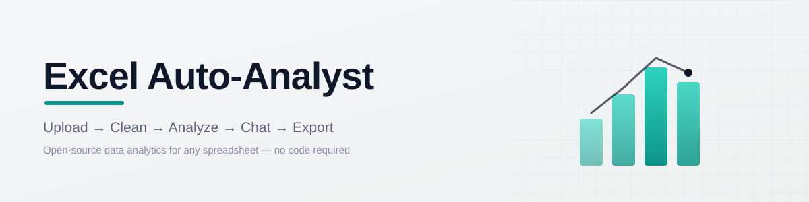
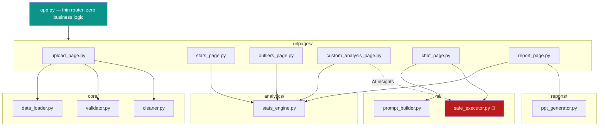
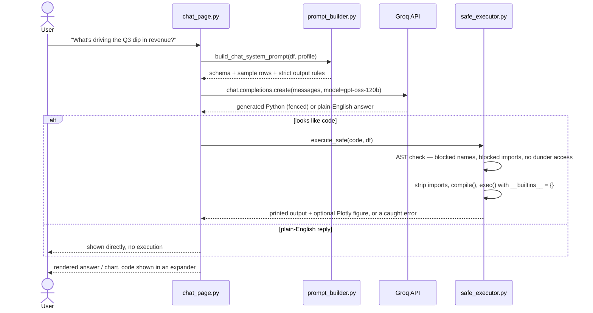

<div align="center">

<picture>
  <source media="(prefers-color-scheme: dark)" srcset="assets/banner-dark.svg">
  <source media="(prefers-color-scheme: light)" srcset="assets/banner-light.svg">
  
</picture>

<br/>

[](https://github.com/Shweta-Mishra-ai/excel-auto-analyst/actions/workflows/ci.yml)
[](https://python.org)
[](https://streamlit.io)
[](https://excel-auto-analyst-ne9ocshgvqtvqtitbapbjs.streamlit.app)
[](https://groq.com)
[](LICENSE)
[](https://github.com/Shweta-Mishra-ai/excel-auto-analyst/stargazers)

[🚀 Live Demo](https://excel-auto-analyst-ne9ocshgvqtvqtitbapbjs.streamlit.app/) &nbsp;·&nbsp; [🐛 Report a Bug](https://github.com/Shweta-Mishra-ai/excel-auto-analyst/issues) &nbsp;·&nbsp; [🤝 Contributing](CONTRIBUTING.md) &nbsp;·&nbsp; [⭐ Star the Repo](https://github.com/Shweta-Mishra-ai/excel-auto-analyst)

</div>

<br/>

> Most "AI data analyst" demos stop at a pretty chat window. Excel Auto-Analyst is the part that comes after: a cleaning pipeline that never silently corrupts your numbers, an execution sandbox that keeps AI-written code from doing anything it shouldn't, and a real audit trail for every transformation — so what you export is something you can actually stand behind.

<br/>

## Contents

- [Demo](#demo)
- [Why this exists](#why-this-exists)
- [Feature tour](#feature-tour)
- [Architecture](#architecture)
- [How a chat question actually gets answered](#how-a-chat-question-actually-gets-answered)
- [Project structure](#project-structure)
- [Quick start](#quick-start)
- [The PPT report (9 slides)](#the-ppt-report-9-slides)
- [Testing and quality gates](#testing-and-quality-gates)
- [Tech stack](#tech-stack)
- [Design decisions](#design-decisions)
- [Contributing](#contributing)

<br/>

## Demo

<video src="https://github.com/Shweta-Mishra-ai/excel-auto-analyst/releases/download/v2.0.0/Excel.demo.mp4" controls="controls" muted="muted" width="100%">
  Your browser does not support the video tag — <a href="https://github.com/Shweta-Mishra-ai/excel-auto-analyst/releases/download/v2.0.0/Excel.demo.mp4">download the demo</a> instead.
</video>

<br/>

## Why this exists

Handing an LLM a spreadsheet and letting it write pandas code sounds simple until three things go wrong at once: it fills missing values with `0` and quietly wrecks every average downstream; it drops your API key check inside a bare `except Exception` and reports "not configured" for a problem that has nothing to do with configuration; or its generated code reaches for `os.system` because nothing actually stopped it.

Excel Auto-Analyst is built around **not doing those three things**:

| Instinct in most demos | What this app does instead |
|---|---|
| Fill missing numbers with `0` | Median imputation by default, every strategy choice logged to an audit trail |
| `exec()` the model's code directly | AST-validated sandbox: blocked imports, blocked builtins, locked `__builtins__` |
| Swallow errors so the UI "just works" | Every failure path sets a visible, specific message — no silent no-ops |

<br/>

## Feature tour

| | Feature | What it does |
|---|---------|---------------|
| 🧹 | **Smart Data Cleaning** | Median/mean/forward-fill imputation, duplicate removal, optional constant/ID-column drop — every step recorded in an audit trail |
| 📈 | **Auto Dashboard** | KPIs, distribution histograms, categorical splits, a correlation heatmap, and month-over-month trend when a date column is present |
| 🔍 | **Outlier Analysis** | IQR or Z-score detection with adjustable thresholds and per-column visual inspection |
| 🎨 | **Custom Report Builder** | Bar, line, scatter, box, and area charts with sort / top-N / filter / aggregate controls, plus an AI-written insight per chart |
| 💬 | **Chat with Your Data** | Ask questions in plain English — the model writes pandas/Plotly code, the sandbox runs it, you see the result |
| 📋 | **One-click PPT Export** | A 9-slide executive presentation with real embedded charts, not screenshots |
| 🔐 | **Sandboxed AI Execution** | AST validation blocks dangerous imports and dunder-attribute tricks; the exec scope carries an empty `__builtins__` so nothing falls back to raw Python |

<br/>

## Architecture


```mermaid
flowchart TB
    App["app.py — thin router, zero business logic"]

    subgraph Core["core/"]
        DL[data_loader.py]
        VA[validator.py]
        CL[cleaner.py]
    end

    subgraph Analytics["analytics/"]
        SE[stats_engine.py]
    end

    subgraph AI["ai/"]
        PB[prompt_builder.py]
        SX["safe_executor.py 🔐"]
    end

    subgraph Reports["reports/"]
        PG[ppt_generator.py]
    end

    subgraph UI["ui/pages/"]
        UP[upload_page.py]
        SP[stats_page.py]
        OP[outliers_page.py]
        CAP[custom_analysis_page.py]
        CHP[chat_page.py]
        RP[report_page.py]
    end

    App --> UI
    UP --> DL
    UP --> VA
    UP --> CL
    SP --> SE
    OP --> SE
    CAP --> SE
    RP --> SE
    CHP --> PB
    CHP --> SX
    CAP -.AI insights.-> SX
    RP --> PG

    style App fill:#0D9488,color:#fff
    style SX fill:#B91C1C,color:#fff
```

Every page reads `st.session_state.load_result` / `.profile` / `.clean_result` and nothing else — there's no hidden coupling between pages beyond that shared state, so any page can be added, removed, or reordered from `app.py`'s nav list alone.

<br/>

## How a chat question actually gets answered

The sandbox is the part worth understanding before you trust it, so here's the real path a question takes — not the marketing version:


```mermaid
sequenceDiagram
    actor U as User
    participant UI as chat_page.py
    participant PB as prompt_builder.py
    participant Groq as Groq API
    participant SX as safe_executor.py

    U->>UI: "What's driving the Q3 dip in revenue?"
    UI->>PB: build_chat_system_prompt(df, profile)
    PB-->>UI: schema + sample rows + strict output rules
    UI->>Groq: chat.completions.create(messages, model=gpt-oss-120b)
    Groq-->>UI: generated Python (fenced) or plain-English answer

    alt looks like code
        UI->>SX: execute_safe(code, df)
        SX->>SX: AST check — blocked names, blocked imports, no dunder access
        SX->>SX: strip imports, compile(), exec() with __builtins__ = {}
        SX-->>UI: printed output + optional Plotly figure, or a caught error
    else plain-English reply
        UI-->>U: shown directly, no execution
    end

    UI-->>U: rendered answer / chart, code shown in an expander
```

Nothing the model writes ever reaches a real Python builtin it wasn't explicitly handed — `getattr`, `eval`, `open`, `os`, and the dunder-attribute tricks that chain through them are blocked at the AST layer, and the exec scope's `__builtins__` is an empty dict rather than the real module, so there's no fallback path to escape through.

<br/>

## Project structure

```
excel-auto-analyst/
│
├── app.py                       # Router — page state, upload handling, nav
├── config/
│   └── settings.py              # All constants, limits, and env resolution
├── core/
│   ├── data_loader.py           # CSV + XLSX ingestion, encoding fallback
│   ├── validator.py             # Semantic type inference, quality scoring
│   └── cleaner.py               # Strategy-based imputation + audit trail
├── analytics/
│   └── stats_engine.py          # KPIs, outliers, correlation, descriptive stats
├── ai/
│   ├── prompt_builder.py        # LLM prompt templates
│   └── safe_executor.py         # AST-sandboxed code runner
├── reports/
│   └── ppt_generator.py         # 9-slide PPT with real embedded charts
├── ui/pages/
│   ├── upload_page.py           # Upload & Data Cleaning
│   ├── stats_page.py            # Auto Dashboard
│   ├── outliers_page.py         # Outlier Analysis
│   ├── custom_analysis_page.py  # Custom Report Builder
│   ├── chat_page.py             # Chat with Data
│   └── report_page.py           # PPT Export
└── tests/                       # 100+ unit tests, 75% coverage gate in CI
```

<br/>

## Quick start

### Option 1 — Streamlit Community Cloud (free, recommended)

```text
1. Fork this repo
2. Go to share.streamlit.io
3. Connect your fork → main file: app.py
4. Add a secret:  GROQ_API_KEY = "gsk_..."
5. Deploy
```

### Option 2 — Run locally

```bash
git clone https://github.com/Shweta-Mishra-ai/excel-auto-analyst.git
cd excel-auto-analyst

pip install -r requirements.txt

echo 'GROQ_API_KEY = "gsk_your_key_here"' > .streamlit/secrets.toml

streamlit run app.py
# → http://localhost:8501
```

Free Groq API key: [console.groq.com](https://console.groq.com) → sign up → create an API key.

### Option 3 — Docker

```bash
docker compose up
# → http://localhost:8501
```

Also ships with `Dockerfile` (multi-stage, non-root user), `render.yaml` for Render, and `railway.toml` for Railway.

<br/>

## The PPT report (9 slides)

| # | Slide | Content |
|---|-------|---------|
| 1 | Cover | Dataset name, quality score, column summary |
| 2 | Data Overview | Row/column count, missing %, memory footprint |
| 3 | KPI Summary | Total, mean, median, std dev, month-over-month change |
| 4 | Distribution | Histogram with mean/median markers |
| 5 | Category Breakdown | Top categories bar chart |
| 6 | Outlier Analysis | IQR detection table per column |
| 7 | Correlation | Heatmap + strong-pairs list |
| 8 | AI Insights | Headline + 3 findings + one recommendation |
| 9 | Closing | Branding slide |

Every chart on the slide is a real embedded PNG generated at report time from the current data — not a static screenshot.

<br/>

## Testing and quality gates

```bash
pip install -r requirements-dev.txt

pytest tests/ -v --cov=. --cov-report=term-missing
ruff check .
ruff format --check .
```

CI runs on every push and PR: **Ruff lint** → **pytest across Python 3.11 / 3.12 with a 75% coverage floor** → **Bandit security scan** → **Docker build verification**. All four gate the merge.

<br/>

## Tech stack

| Layer | Tools |
|-------|-------|
| **Frontend** | Streamlit |
| **AI / LLM** | Groq API · `openai/gpt-oss-120b` |
| **Data** | pandas · NumPy · openpyxl |
| **Charts** | Plotly · Matplotlib |
| **Reports** | python-pptx |
| **Sandbox** | AST validation + locked `__builtins__` (no third-party sandbox dependency) |
| **Testing** | pytest · pytest-cov |
| **Linting / Security** | Ruff · Bandit |
| **Deploy** | Streamlit Cloud · Docker · Render · Railway |

<br/>

## Design decisions

**Why median imputation, not zero?**
Zero-filling missing values corrupts means, KPIs, and correlations — a column that's 30% missing and zero-filled will report a mean far below reality. Median preserves the distribution's shape without inventing data that was never there.

**Why hand-rolled AST validation instead of a sandboxing library?**
It was tried the other way first. `RestrictedPython` was wired in, but its write/subscript guards reject ordinary pandas mutation like `df['col'] = df['col'] * 2` — exactly what AI-generated analysis code needs to do constantly. A dependency that's either unusable or silently inert isn't a security layer. The AST checker plus an empty exec-scope `__builtins__` is smaller, fully tested, and actually engages on every run.

**Why Groq?**
Inference is fast enough that AI-generated charts in the chat tab feel interactive rather than queued. The model id lives in one place (`config/settings.py`) specifically so a provider-side deprecation is a one-line fix, not a hunt across five files.

<br/>

## Contributing

Bug reports, feature ideas, and PRs are welcome — see [CONTRIBUTING.md](CONTRIBUTING.md) for the branch, lint, and test conventions this repo expects.

<br/>

<div align="center">

Made with ❤️ by [Shweta Mishra](https://github.com/Shweta-Mishra-ai) &nbsp;·&nbsp; MIT License

*If this saved you time — a ⭐ means a lot.*

</div>
